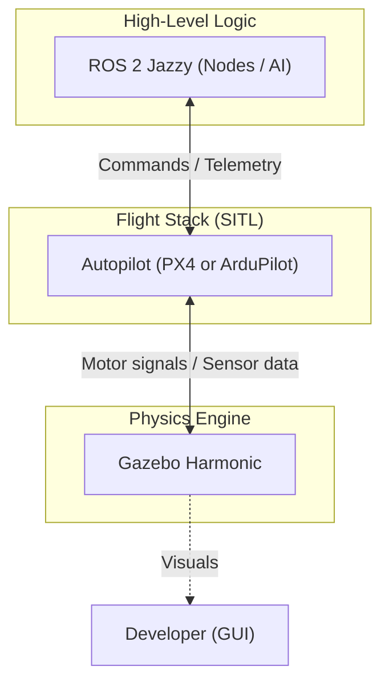

# Drone SITL Development Environment

A containerized Software-In-The-Loop (SITL) development environment for drone simulation using **ROS 2 Jazzy**, **Gazebo Harmonic**, **PX4-Autopilot**, and **ArduPilot**.

This project provides a unified, reproducible environment powered by Podman (or Docker) to develop and test drone control logic without the need for manual dependency management on your host machine.

## 🧩 Software Stack & Ecosystem

Understanding how these components work together is key to drone development.

### 1. Autopilot Stacks (PX4 & ArduPilot)
*   **Role**: The "Flight Controller" or "Brain".
*   **Function**: These are the flight stacks that run the algorithms for stabilization, navigation (GPS/EKF), and mission management.
*   **Objective**: To interpret high-level commands and transform them into precise motor speeds to keep the aircraft flying.
*   **SITL Mode**: Running in "Software-In-The-Loop", the autopilot "thinks" it is on real hardware but communicates with a simulator instead of real motors and sensors.

### 2. Physics Simulator (Gazebo Harmonic)
*   **Role**: The "Virtual World".
*   **Function**: A high-fidelity physics engine that simulates gravity, wind, collisions, and sensors (Camera, LiDAR, IMU).
*   **Objective**: To provide a safe environment where you can crash a drone 1,000 times without any repair costs.
*   **Relationship**: It receives motor/actuator signals from the Autopilot and sends back simulated sensor data (like "the drone is now tilted 5 degrees").

### 3. Middleware (ROS 2 Jazzy)
*   **Role**: The "Application Layer".
*   **Function**: Provides the communication framework (Topics, Services, Actions) for high-level logic like Object Avoidance, Swarm Coordination, or SLAM.
*   **Objective**: To abstract the hardware. Instead of talking to a specific motor, your ROS node sends a `cmd_vel` (velocity command) to the Autopilot.
*   **Relationship**: It talks to PX4 (via Micro XRCE-DDS) or ArduPilot (via MAVROS/DDS) to bridge high-level AI logic with low-level flight control.

### 🔄 System Architecture



## ⚖️ PX4 vs. ArduPilot: Which to use?

While both flight stacks are provided in this environment, you typically only use **one** for a specific project. They are "selective options."

| Feature | **PX4-Autopilot** | **ArduPilot** |
| :--- | :--- | :--- |
| **Best For** | Academic research, computer vision, and ROS-heavy projects. | Commercial/industrial missions and wide hardware compatibility. |
| **Middleware** | Native **Micro XRCE-DDS** (very efficient for ROS 2). | **MAVROS** or the new DDS bridge. |
| **Architecture** | Modular, Unix-like, modern "app" structure. | Feature-rich, mature, "all-in-one" flight stack. |
| **Tooling** | Optimized for **QGroundControl**. | Optimized for **Mission Planner** (Windows) and QGC. |

**Recommendation**: Since this environment uses **ROS 2 Jazzy**, **PX4** is recommended for new users due to its native, high-performance integration with ROS 2.

## 🚀 Quick Start

### 1. Build and Start the Environment
First, ensure you have Podman installed. Then, use the provided Makefile to build and launch the development container:

```bash
# Build the container image
make build

# Start the container in the background and enable X11 access
make run
```

### 2. Setup the Workspace
The first time you run the environment, you need to clone the PX4 and ArduPilot source code and install their internal dependencies. This is done inside the container but persists on your host machine via volumes.

```bash
make setup-workspace
```
*Note: This step may take several minutes as it downloads the firmware repositories and toolchains.*

## 🛠️ Usage

### Running Simulations
Once the setup is complete, you can launch simulations directly using the Makefile:

**For PX4 (Gazebo x500):**
```bash
make px4-sitl
```

**For ArduPilot (Gazebo Iris):**
```bash
make ardupilot-sitl
```

### Bridging to ROS 2 (PX4)
To enable communication between PX4 and ROS 2, you must run the Micro XRCE-DDS Agent. Open a **new terminal** on your host and run:
```bash
make dds-agent
```
*Note: This must be running for ROS 2 nodes to see PX4 topics like `/fmu/out/vehicle_odometry`.*

### Accessing the Shell
To open an interactive terminal inside the running container:
```bash
make shell
```

### Administrative Commands
- `make build`: Rebuild the container image.
- `make reboot`: Restart the container environment.
- `make stop`: Stop the running container.
- `make clean`: Remove containers, images, and volumes (use with caution).

## 📂 Project Structure

- `Containerfile`: Defines the ROS 2 Jazzy + Gazebo Harmonic environment.
- `compose.yml`: Configures Podman/Docker volumes, networking, and X11 forwarding.
- `Makefile`: Convenient shortcuts for common development tasks.
- `scripts/`:
    - `setup_workspace.sh`: Clones firmware repos and installs toolchains.
    - `run.sh`: Handles host-side display permissions and starts the container.
- `PX4-Autopilot/`: (Created after setup) PX4 firmware source.
- `ardupilot/`: (Created after setup) ArduPilot firmware source.

## 🖥️ Requirements
- **Linux Host** (Tested on Ubuntu/Fedora)
- **Podman** & **Podman Compose** (recommended) or Docker.
- **X11 or Wayland** (for Gazebo GUI support).

## 📝 Configuration Note
By default, the environment uses your current host user's UID/GID to ensure that files created inside the container (like build artifacts or clones) are owned by you on the host machine.
